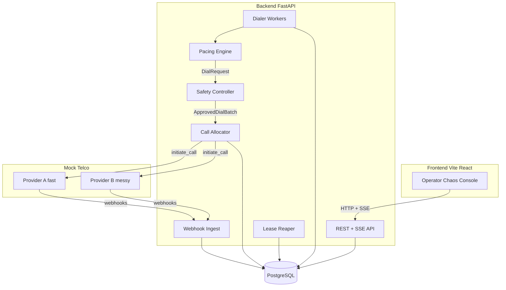
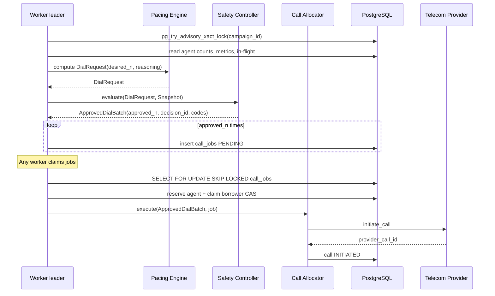
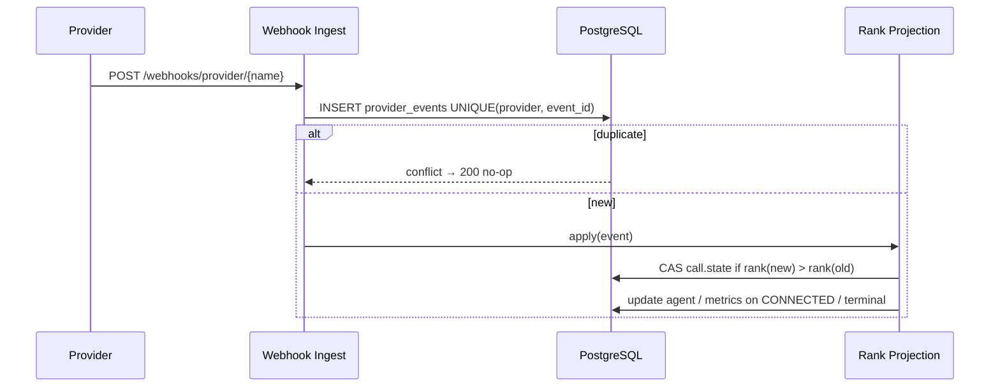

# 01 — Architecture

## Component view



## Request / dial sequence



## Webhook / projection sequence



## Process topology (docker-compose)

| Service | Role |
|---------|------|
| `postgres` | Single source of truth |
| `backend` | API + SSE (uvicorn) |
| `worker` | N replicas: pacing leader election, job claim, heartbeats |
| `mock-telco` | HTTP provider + outbound webhooks |
| `frontend` | Vite static / dev server |

Workers are identical. Leadership for pacing is per-tick via `pg_try_advisory_xact_lock`. Job consumption is fully symmetric via `SKIP LOCKED`.

## Package boundaries (backend)

```
app/
  domain/       models, state machines, reservation helpers
  pacing/       DialRequest only — NO imports of providers or allocator
  safety/       evaluates DialRequest → ApprovedDialBatch
  allocation/   accepts ApprovedDialBatch only
  providers/    TelecomProvider port + adapters
  workers/      pacing tick, job consumer, reaper
  api/          REST, SSE, chaos, webhooks
  db/           Tortoise config, clock port
```

Import rule: `pacing` must not import `providers`, `allocation`, or write APIs. Enforced by test.

## Why this shape

- **One DB** — no cache coherence interviews to lose.
- **Capability token** — predictive cannot dial around safety.
- **Advisory lock + SKIP LOCKED** — coordinates N workers without a broker.
- **Separate mock-telco** — exercises real webhook idempotency.
- **SSE** — one-way live UI is enough; no WebSocket lifecycle.

## What we deliberately did not build

Kafka, Redis, microservices split for Safety Controller, ML models, real SSR frontend, multi-region failover.
