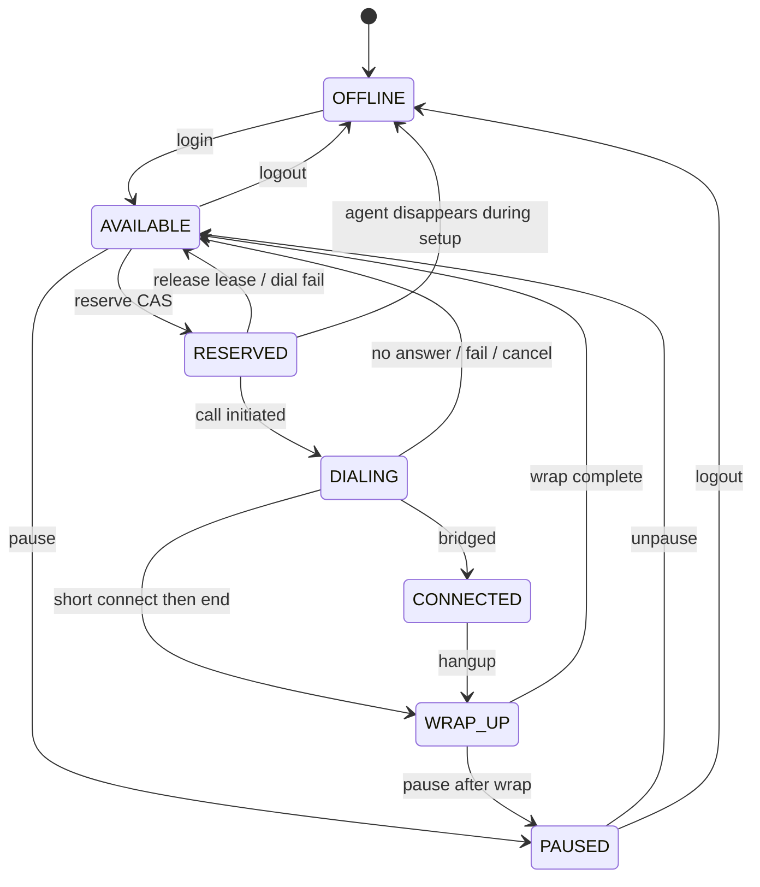

# 02 — Agent State Machine

## States

| State | Meaning |
|-------|---------|
| `OFFLINE` | Not in the dialer pool |
| `AVAILABLE` | Eligible for reservation |
| `RESERVED` | Bound to a dial attempt; lease held |
| `DIALING` | Outbound call in progress for this agent |
| `CONNECTED` | Talking to borrower |
| `WRAP_UP` | Post-call work; not yet AVAILABLE |
| `PAUSED` | Operator pause; not dialable |

## Rank (monotonic for recovery ordering)

| State | Rank |
|-------|------|
| OFFLINE | 0 |
| PAUSED | 1 |
| AVAILABLE | 2 |
| RESERVED | 3 |
| DIALING | 4 |
| CONNECTED | 5 |
| WRAP_UP | 6 |

Agent lifecycle is not a single forward rank like calls (agents return to AVAILABLE). Ranks here are for documentation and illegal-transition checks, not for absorbing projection.

## Legal transitions



## Reservation (the interview question)

Two workers see the same AVAILABLE agent. Both must not reserve it.

```python
async with in_transaction() as conn:
    agent = await Agent.filter(state="AVAILABLE", campaign_id=cid)\
        .select_for_update(skip_locked=True)\
        .using_db(conn)\
        .order_by("id")\
        .first()
    if not agent:
        return None
    rows = await Agent.filter(
        id=agent.id, state="AVAILABLE", version=agent.version
    ).using_db(conn).update(
        state="RESERVED",
        version=agent.version + 1,
        locked_by=worker_id,
        lease_expires_at=now + LEASE_TTL,
        reserved_call_id=call_id,
    )
    if rows != 1:
        raise ReservationLost()
```

1. `SKIP LOCKED` — second transaction skips the row locked by the first.
2. CAS on `(state, version)` — defense if state changed between read and write.
3. **Mandatory** `.using_db(conn)` — Tortoise does not bind queries to the open transaction automatically.

## Agent disappears during setup

If agent goes OFFLINE/PAUSED while RESERVED or DIALING:

1. Provider call is cancelled if still pre-answer.
2. If already ANSWERED with no replacement agent within hold window → safe-harbour abandon.
3. Agent row released only after call reaches a terminal or abandoned state consistent with metrics.

## Heartbeat

While RESERVED/DIALING, owning worker refreshes `lease_expires_at`. Reaper releases expired leases back to AVAILABLE (or OFFLINE if marked gone) and fails/reconciles the associated call.
