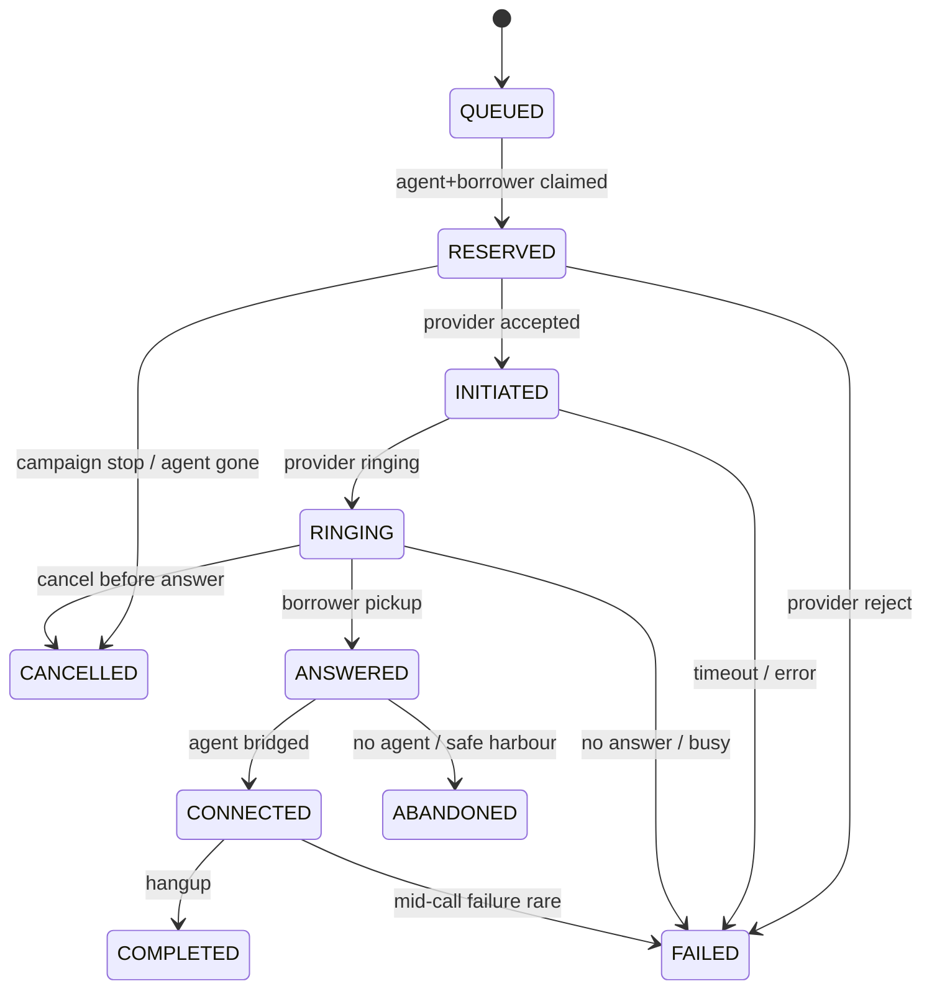

# 03 — Call State Machine

## States

| State | Rank | Terminal? |
|-------|------|-----------|
| `QUEUED` | 10 | no |
| `RESERVED` | 20 | no |
| `INITIATED` | 30 | no |
| `RINGING` | 40 | no |
| `ANSWERED` | 50 | no |
| `CONNECTED` | 60 | no |
| `COMPLETED` | 100 | yes |
| `FAILED` | 100 | yes |
| `CANCELLED` | 100 | yes |
| `ABANDONED` | 100 | yes |

Terminal states share rank 100 and are **absorbing**: once reached, no further state change is applied (timestamps may still backfill).

## Legal forward transitions



## Rank-monotonic projection

Provider events are append-only in `provider_events` with `UNIQUE (provider, provider_event_id)`.

On each new event:

1. Map event type → proposed state.
2. If `rank(proposed) > rank(current)` → CAS update `state`, `version`, timestamps.
3. If `rank(proposed) <= rank(current)` → store event, set `out_of_order=true`, optionally backfill `answered_at` / `ringing_at` without changing state.
4. If current is terminal → never leave terminal; backfill only.

### Pathological sequences (must end consistent)

| Events | Expected end |
|--------|--------------|
| ANSWERED ×3 then COMPLETED | CONNECTED path or ABANDONED then COMPLETED ignored if already terminal; one logical call |
| COMPLETED, ANSWERED, RINGING | First COMPLETED → COMPLETED; later lower-rank ignored for state |
| ANSWERED then worker crash then COMPLETED | Event log durable; another worker projects COMPLETED |

## Idempotency

- Duplicate webhook: unique constraint → HTTP 200, no second transition.
- Retried initiate: allocator stores `idempotency_key` on call/job; provider port accepts it.

## Optimistic versioning

```sql
UPDATE calls
SET state = $new, version = version + 1, ...
WHERE id = $id AND version = $expected AND rank(state) < rank($new);
```

Bounded retry (e.g. 3) on version conflict.

## Metrics hooks

| Transition | Metric effect |
|------------|---------------|
| RINGING → ANSWERED | answer sample for EWMA |
| ANSWERED → ABANDONED | abandonment numerator |
| ANSWERED → CONNECTED | connected count; talk-time start |
| CONNECTED → COMPLETED | talk-time sample |
| * → FAILED | provider / dial failure counters |
